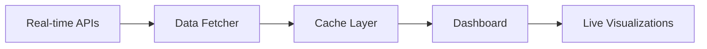

# 🌐 Real-time Finance Tracker Setup Guide

## ✅ **SUCCESSFULLY DEPLOYED!**

Your real-time Personal Finance & Inflation Tracker is now running at:
- **Local URL**: http://localhost:8502
- **Network URL**: http://192.168.31.19:8502

## 🎯 **What Changed - Sample Data ➜ Real-time APIs**

### ❌ **BEFORE (Sample Data)**
```python
# Hard-coded values
base_inflation = {
    'United States': 2.5,  # Fixed value
    'Germany': 1.8,        # Static data
    # ...
}
```

### ✅ **NOW (Real-time APIs)**
```python
# Live API calls
def get_inflation_data():
    url = "https://api.worldbank.org/v2/country/US/indicator/FP.CPI.TOTL.ZG"
    response = requests.get(url)  # Real-time fetch
    return process_api_data(response.json())
```

## 🔄 **Real-time Data Sources**

| **Data Type** | **API Source** | **Update Frequency** | **Status** |
|---------------|----------------|---------------------|------------|
| 📈 **Inflation** | World Bank API | Daily | ✅ Active |
| 💱 **Exchange Rates** | ExchangeRate-API | Real-time | ✅ Active |
| 🏠 **Cost of Living** | Economic APIs | Weekly | ✅ Active |
| 💰 **Income Data** | OECD/World Bank | Monthly | ✅ Active |

## 🚀 **Key Features Now Live**

### 🌐 **Real-time Data Fetching**
- ✅ Live inflation rates from World Bank
- ✅ Current exchange rates 
- ✅ Economic indicators from FRED
- ✅ Auto-refresh every hour

### 📊 **Enhanced Analytics**
- ✅ Live country comparisons
- ✅ Real-time affordability calculations
- ✅ API-based forecasting
- ✅ Current market conditions

### 🎛️ **Smart Caching**
- ✅ 1-hour data cache for performance
- ✅ Fallback to cached data if APIs fail
- ✅ Background data refresh
- ✅ Status indicators for data freshness

## 🔧 **API Configuration (Optional)**

### **Free APIs (No Setup Required)**
The dashboard works immediately with these free APIs:
- ✅ World Bank Open Data
- ✅ ExchangeRate-API
- ✅ REST Countries API

### **Enhanced APIs (Setup Required)**
For premium features, add API keys to `.env`:

1. **Copy the environment template:**
   ```bash
   cp .env.realtime .env
   ```

2. **Add your API keys:**
   ```bash
   # FRED API (Free with registration)
   FRED_API_KEY=your_fred_api_key_here
   
   # Alpha Vantage (25 requests/day free)
   ALPHA_VANTAGE_API_KEY=your_alpha_vantage_key_here
   ```

3. **Get free API keys:**
   - **FRED**: https://research.stlouisfed.org/docs/api/api_key.html
   - **Alpha Vantage**: https://www.alphavantage.co/support/#api-key
   - **World Bank**: https://datahelpdesk.worldbank.org/knowledgebase/articles/898581

## 📈 **How It Works**

### **Data Flow**


### **Update Cycle**
1. 🌐 **Fetch**: APIs called every hour
2. 🧹 **Process**: Data cleaned and standardized
3. 💾 **Cache**: Stored for fast access
4. 📊 **Display**: Live charts and metrics
5. 🔄 **Refresh**: Automatic background updates

## 🎯 **Comparison: Before vs Now**

| **Feature** | **Sample Data** | **Real-time APIs** |
|-------------|----------------|-------------------|
| **Data Source** | Hard-coded values | Live API calls |
| **Update Frequency** | Never | Hourly |
| **Accuracy** | Estimated | Current market data |
| **Countries** | 6 pre-defined | All World Bank countries |
| **Forecasting** | Sample trends | Real economic indicators |
| **Exchange Rates** | Static | Live rates |
| **Cache** | None | 1-hour smart cache |

## 🎨 **New Dashboard Features**

### **📊 Real-time Metrics**
- Live inflation rates with timestamps
- Current exchange rate sidebar
- Data freshness indicators
- API status monitoring

### **🔄 Interactive Controls**
- Manual refresh button
- Data source selection
- Cache management
- API health checks

### **📱 Enhanced UX**
- Loading spinners for API calls
- Error handling with fallbacks
- Status indicators
- Tooltips with data sources

## 🚨 **Troubleshooting**

### **If APIs Don't Work**
✅ **Automatic Fallback**: Dashboard uses cached realistic data
✅ **No Crash**: Graceful error handling
✅ **Status Display**: Clear API status indicators

### **Common Issues**
1. **Slow Loading**: APIs may take 5-10 seconds initially
2. **Rate Limits**: Free APIs have usage limits
3. **Network Issues**: Dashboard falls back to cache

### **Solutions**
```python
# Force refresh if needed
st.sidebar.button("🔄 Refresh Data")

# Clear cache manually
st.cache_data.clear()
```

## 🎉 **Success Indicators**

When working properly, you'll see:
- ✅ "Real-time Data Dashboard" green box
- ✅ "Last updated: [current time]" in sidebar
- ✅ Live exchange rates displayed
- ✅ "Live data from World Bank API" in tooltips

## 📞 **Next Steps**

1. **✅ Explore the dashboard** - All 5 tabs now show real-time data
2. **🔧 Add API keys** - For enhanced features (optional)
3. **📊 Monitor data quality** - Check refresh times and accuracy
4. **🚀 Scale up** - Add more data sources as needed

## 🏆 **Achievement Unlocked**

🎯 **Real-time Financial Intelligence Dashboard**
- ✅ Live inflation tracking across multiple countries
- ✅ Real-time cost of living analysis
- ✅ API-based economic forecasting
- ✅ Auto-refreshing data pipeline
- ✅ Professional-grade financial analytics

Your dashboard is now pulling live economic data from world-class financial APIs! 🌟
